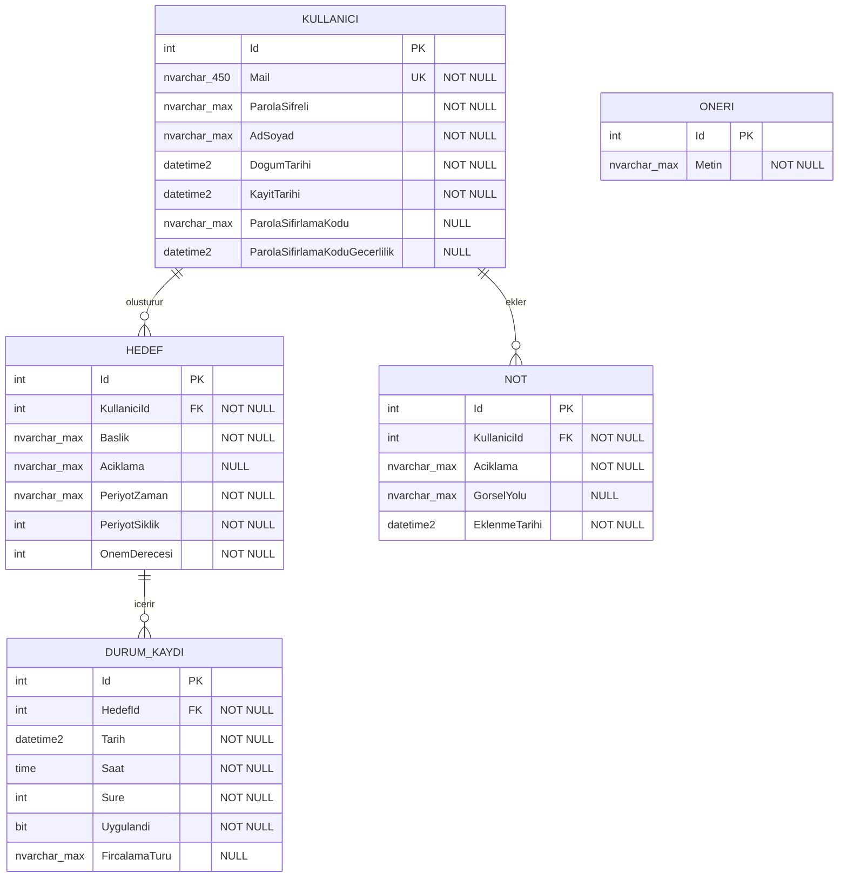

# Veritabanı Şeması

`AgizDisSagligiDb` veritabanının varlık-ilişki diyagramı ve tablo tanımları. Kaynak: `AgizDisSagligi.Entities` ve `AgizDisSagligi.DataAccess` (Code First, EF Core migration'ları).

`Oneriler` tablosunun diğer tablolarla ilişkisi yoktur; sabit öneri metinlerini tutar ve migration seed data'sıyla önceden doldurulur.

## Kullanicilar

| Sütun | Tip | Null? | Açıklama |
|---|---|---|---|
| Id | int | Hayır | Birincil anahtar, identity |
| Mail | nvarchar(450) | Hayır | Benzersiz index; giriş kimliği olarak kullanılır |
| ParolaSifreli | nvarchar(max) | Hayır | Parolanın AES ile şifrelenmiş hâli (düz metin tutulmaz) |
| AdSoyad | nvarchar(max) | Hayır | |
| DogumTarihi | datetime2 | Hayır | |
| KayitTarihi | datetime2 | Hayır | Kayıt anında sunucu tarafında atanır |
| ParolaSifirlamaKodu | nvarchar(max) | Evet | Aktif bir parola sıfırlama isteği yoksa boş |
| ParolaSifirlamaKoduGecerlilik | datetime2 | Evet | Sıfırlama kodunun son geçerlilik zamanı |

**Index:** `IX_Kullanicilar_Mail` (unique)

## Hedefler

| Sütun | Tip | Null? | Açıklama |
|---|---|---|---|
| Id | int | Hayır | Birincil anahtar, identity |
| KullaniciId | int | Hayır | `Kullanicilar.Id` referansı |
| Baslik | nvarchar(max) | Hayır | |
| Aciklama | nvarchar(max) | Evet | |
| PeriyotZaman | nvarchar(max) | Hayır | Hedefin tekrar periyodu (ör. günlük/haftalık) |
| PeriyotSiklik | int | Hayır | Periyot başına hedeflenen tekrar sayısı |
| OnemDerecesi | int | Hayır | |

**Index:** `IX_Hedefler_KullaniciId`

## DurumKayitlari

| Sütun | Tip | Null? | Açıklama |
|---|---|---|---|
| Id | int | Hayır | Birincil anahtar, identity |
| HedefId | int | Hayır | `Hedefler.Id` referansı |
| Tarih | datetime2 | Hayır | |
| Saat | time | Hayır | |
| Sure | int | Hayır | Uygulama süresi (dakika) |
| Uygulandi | bit | Hayır | |
| FircalamaTuru | nvarchar(max) | Evet | |

**Index:** `IX_DurumKayitlari_HedefId`

## Notlar

| Sütun | Tip | Null? | Açıklama |
|---|---|---|---|
| Id | int | Hayır | Birincil anahtar, identity |
| KullaniciId | int | Hayır | `Kullanicilar.Id` referansı |
| Aciklama | nvarchar(max) | Hayır | |
| GorselYolu | nvarchar(max) | Evet | `wwwroot/uploads` altındaki göreli dosya yolu |
| EklenmeTarihi | datetime2 | Hayır | Kayıt anında sunucu tarafında atanır |

**Index:** `IX_Notlar_KullaniciId`

## Oneriler

| Sütun | Tip | Null? | Açıklama |
|---|---|---|---|
| Id | int | Hayır | Birincil anahtar, identity |
| Metin | nvarchar(max) | Hayır | |

Sabit içerikli 7 satır migration seed data ile eklenir; uygulama tarafından yazılmaz.

## İlişkiler

- `Kullanicilar (1) → Hedefler (N)` — `Hedef.KullaniciId`
- `Kullanicilar (1) → Notlar (N)` — `Not.KullaniciId`
- `Hedefler (1) → DurumKayitlari (N)` — `DurumKaydi.HedefId`

Üç ilişki de `ON DELETE CASCADE` olarak tanımlıdır: bir kullanıcı silindiğinde hedefleri ve notları, bir hedef silindiğinde ona ait durum kayıtları da silinir.

İlişkiler, ilgili varlıklardaki navigasyon property'leri üzerinden EF Core tarafından konfigüre edilir (bkz. `AppDbContextModelSnapshot.cs`); veritabanı tarafında migration'lar ile uygulanır.
