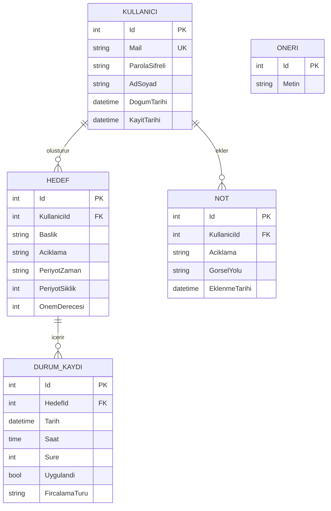

# Veritabanı Şeması

`AgizDisSagligiDb` veritabanının varlık-ilişki (ER) diyagramı. Kaynak: `AgizDisSagligi.Entities` ve `AgizDisSagligi.DataAccess/AppDbContext.cs`.

## Tablolar

| Tablo | Açıklama | İlişki |
|---|---|---|
| `Kullanicilar` | Kayıtlı kullanıcılar, mail alanı benzersiz (unique index) | 1 kullanıcı → N hedef, 1 kullanıcı → N not |
| `Hedefler` | Kullanıcının belirlediği alışkanlık hedefleri (periyot + önem derecesi) | `KullaniciId` → `Kullanicilar.Id` |
| `DurumKayitlari` | Bir hedefin belirli tarih/saatte uygulanıp uygulanmadığı kaydı | `HedefId` → `Hedefler.Id` |
| `Notlar` | Kullanıcının serbest metin + görselle eklediği gözlemler | `KullaniciId` → `Kullanicilar.Id` |
| `Oneriler` | Rastgele gösterilen sabit öneri metinleri (bağımsız tablo) | — |

Tüm foreign key ilişkileri Entity Framework Core navigasyon property'leri (`Kullanici`, `Hedef`) üzerinden, `AppDbContext.OnModelCreating` içindeki konfigürasyon ve migration'lar aracılığıyla veritabanına yansıtılır.
